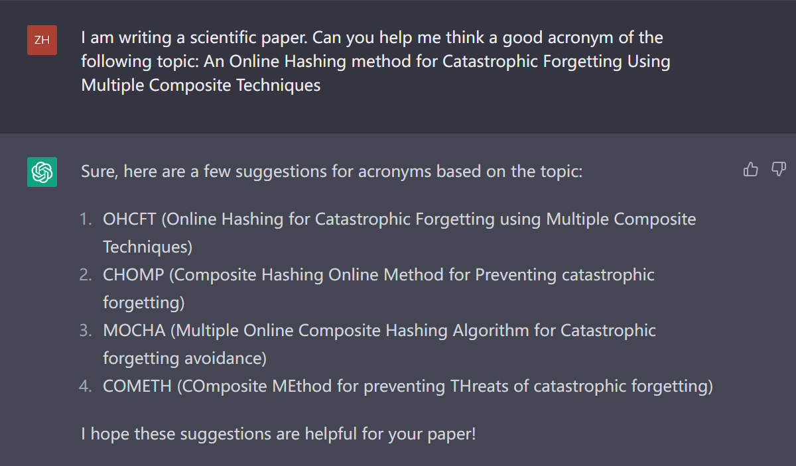
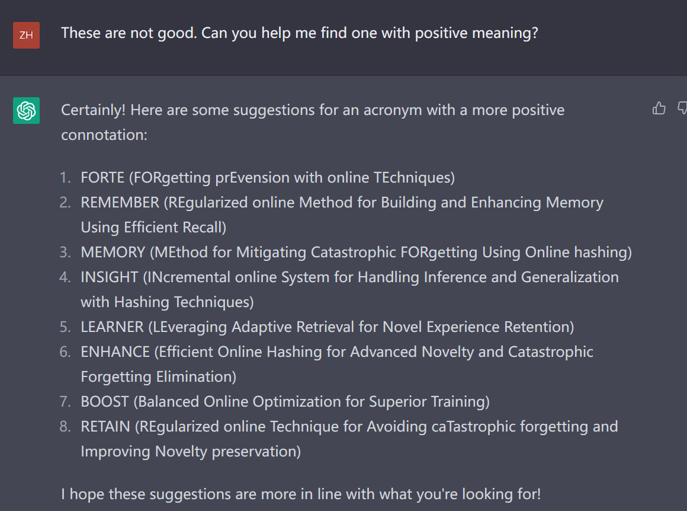
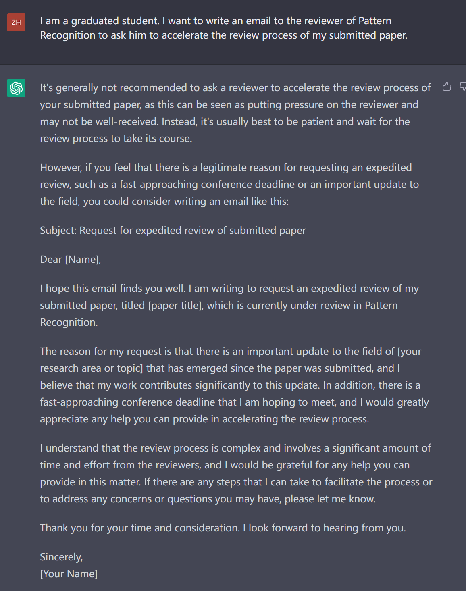
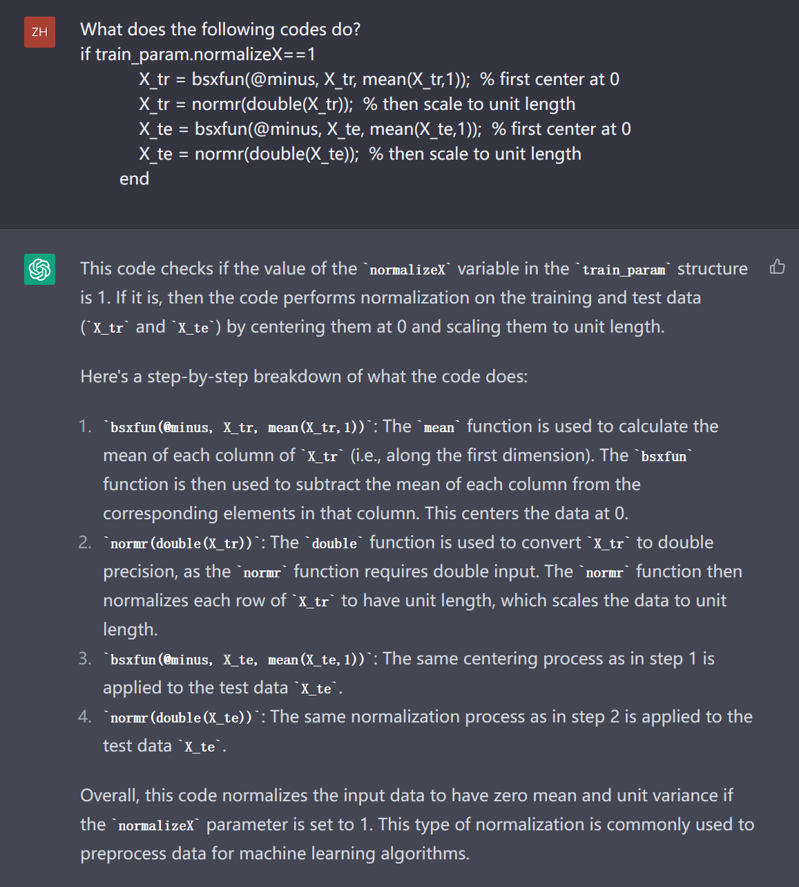

### 润色语句

- Please act like a native speaker and revise my sentence as follows.

- I want you to act as an academic journal editor. Please rephrase the paragraph from an academic angle based on the writing style of the CVPR.
- **给科研论文起名和缩写**——I am writing a scientific paper. Can you help me think a good acronym of the following topic: An Online Hashing method for Catastrophic Forgetting Using Multiple Composite Techniques.



- **如果不满意，可以要求再给**——These are not good. Can you help me find one with positive meaning?



- ** 请改写以下段落，让用词更准确、内容更丰富[content]**
### 写邮件

- **申请套磁信**——I am a graduated student. I want to write an email to a professor in UIUC working on information retrieval to sell my experience and ask him if he is willing to recruit me as PhD student in the next year.


- **催促审稿**——I am a graduated student. I want to write an email to the reviewer of Pattern Recognition to ask him to accelerate the review process of my submitted paper.



- **向导师请假**——


### 辅助代码阅读

- **这段代码干了啥事**——What does the following codes do?



- **给代码添加注释**—— Please add comments to the following codes
  xxxxxxx

```matlab
for ii = 1:length(loopnbits)
for jj = 1:length(hashmethods)            
Table_ItoT_MAP(jj,ii) = eva_info{jj,ii}{param.nchunks}.Image_VS_Text_MAP;            
Table_TtoI_MAP(jj,ii) = eva_info{jj,ii}{param.nchunks}.Text_VS_Image_MAP;                        
for kk = 1:param.nchunks                
% MAP                
Image_VS_Text_MAP{ii}{jj,kk} = eva_info{jj,ii}{kk}.Image_VS_Text_MAP;                
Text_VS_Image_MAP{ii}{jj,kk} = eva_info{jj,ii}{kk}.Text_VS_Image_MAP;                                
% Precision VS Recall                
Image_VS_Text_recall{ii}{jj,kk,:}    = eva_info{jj,ii}{kk}.Image_VS_Text_recall';                Image_VS_Text_precision{ii}{jj,kk,:} = eva_info{jj,ii}{kk}.Image_VS_Text_precision';                Text_VS_Image_recall{ii}{jj,kk,:}    = eva_info{jj,ii}{kk}.Text_VS_Image_recall';                Text_VS_Image_precision{ii}{jj,kk,:} = eva_info{jj,ii}{kk}.Text_VS_Image_precision';                 
% Top number Precision                
Image_To_Text_Precision{ii}{jj,kk,:} = eva_info{jj,ii}{kk}.Image_To_Text_Precision;               Text_To_Image_Precision{ii}{jj,kk,:} = eva_info{jj,ii}{kk}.Text_To_Image_Precision;                 trainT{ii}{jj,kk} = eva_info{jj,ii}{kk}.trainT;            
end        
end    
end
```

**after a while** 

```matlab
        
for ii = 1:length(loopnbits)  % loop over number of bits to be used in hashing
        for jj = 1:length(hashmethods)  % loop over different hash methods
            % Extract MAP scores for Image vs. Text and Text vs. Image
            Table_ItoT_MAP(jj,ii) = eva_info{jj,ii}{param.nchunks}.Image_VS_Text_MAP;
            Table_TtoI_MAP(jj,ii) = eva_info{jj,ii}{param.nchunks}.Text_VS_Image_MAP;
            
            for kk = 1:param.nchunks  % loop over each chunk of data
            % Extract MAP scores for Image vs. Text and Text vs. Image for each chunk
            Image_VS_Text_MAP{ii}{jj,kk} = eva_info{jj,ii}{kk}.Image_VS_Text_MAP;
            Text_VS_Image_MAP{ii}{jj,kk} = eva_info{jj,ii}{kk}.Text_VS_Image_MAP;
            
            % Extract Precision vs. Recall data for Image vs. Text and Text vs. Image for each chunk
            Image_VS_Text_recall{ii}{jj,kk,:}    = eva_info{jj,ii}{kk}.Image_VS_Text_recall';
            Image_VS_Text_precision{ii}{jj,kk,:} = eva_info{jj,ii}{kk}.Image_VS_Text_precision';
            Text_VS_Image_recall{ii}{jj,kk,:}    = eva_info{jj,ii}{kk}.Text_VS_Image_recall';
            Text_VS_Image_precision{ii}{jj,kk,:} = eva_info{jj,ii}{kk}.Text_VS_Image_precision';

            % Extract top number precision data for Image vs. Text and Text vs. Image for each chunk
            Image_To_Text_Precision{ii}{jj,kk,:} = eva_info{jj,ii}{kk}.Image_To_Text_Precision;
            Text_To_Image_Precision{ii}{jj,kk,:} = eva_info{jj,ii}{kk}.Text_To_Image_Precision;

            % Extract training data for each chunk
            trainT{ii}{jj,kk} = eva_info{jj,ii}{kk}.trainT;
        end
    end
end
```

### 生成代码

示例：分割MIRFlickr数据集，split the training set into 9 chunks and first 8 has 2000 samples, and the last chunk has 2015 samples. 

```matlab
% Set parameters
n_chunks = 9;
chunk_size = [repmat(2000, [1, n_chunks-1]), 2015];
n_samples = sum(chunk_size);

% Shuffle samples
idx = randperm(n_samples);

% Split into chunks
train_chunks = cell(n_chunks, 1);
start_idx = 1;
for i = 1:n_chunks
    end_idx = start_idx + chunk_size(i) - 1;
    train_chunks{i} = train_set(idx(start_idx:end_idx), :);
    start_idx = end_idx + 1;
end
```

